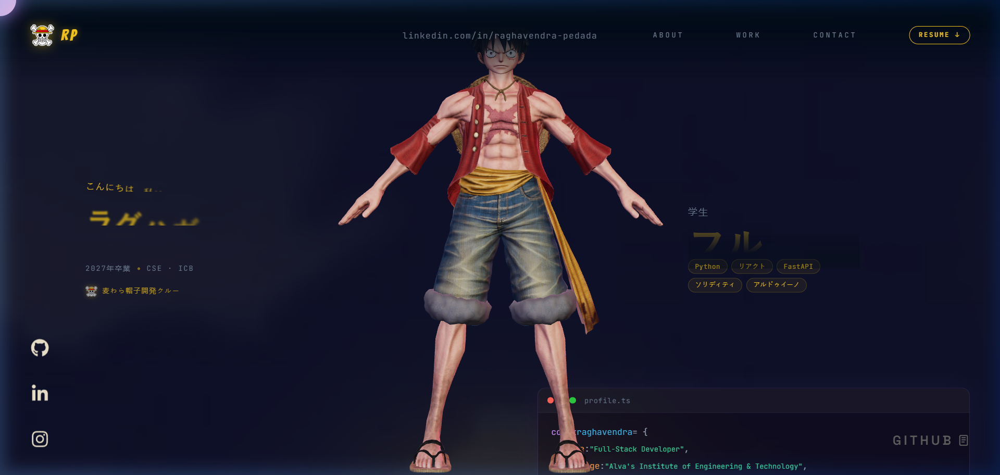
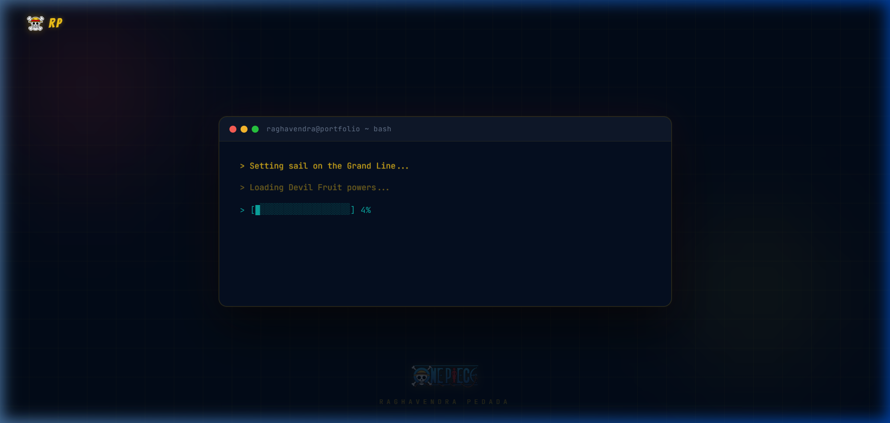

# 🏴‍☠️ One Piece Themed 3D Developer Portfolio

[](https://reactjs.org/)
[](https://threejs.org/)
[](https://gsap.com/)
[](https://vitejs.dev/)
[](https://www.typescriptlang.org/)

An immersive, hardware-accelerated **One Piece themed 3D developer portfolio** for **Raghavendra Pedada** (Full-Stack Developer & CSE Student). Built using **React 18**, **Three.js**, **React Three Fiber (R3F)**, and **GSAP animations**. 

Features an interactive 3D **Monkey D. Luffy** character with real-time head tracking, custom Japanese-to-English TV static glitch effects, anime ocean theme aesthetics, and smooth timeline scroll animations.

---

## 📸 Preview


<p align="center">
  
</p>

<p align="center">
  
</p>

---

## ✨ Key Features

* 🏴‍☠️ **Interactive 3D Luffy Model**: Real-time 3D rendering of Monkey D. Luffy with mouse-following head rotation and procedural breathing idle animation.
* 🎌 **Japanese → Glitch → English Intro**: Dynamic intro revealing page content in Japanese (*こんにちは、私は...*) followed by a TV static scanline & RGB chromatic aberration glitch transition into English.
* 🌊 **One Piece Theme & Branding**: Ocean midnight palette, Straw Hat pirate gold highlights (`#f5c518`), crimson glows, and custom Jolly Roger skull logo.
* ⚡ **Performance Optimized**: Auto-scaled bounding boxes, low draw call 3D scene setup, lazy-loaded Draco geometry, and smooth 60fps animations.
* 📱 **Fully Responsive**: Adaptive camera framing, mobile touch interactions, and fluid typography.

---

## 🛠️ Tech Stack

* **Frontend**: React 18, TypeScript
* **Build Tool**: Vite
* **3D Graphics**: Three.js, `@react-three/fiber`, `@react-three/drei`
* **Animations**: GSAP (GreenSock), ScrollTrigger, ScrollSmoother
* **Styling**: Vanilla CSS with custom design tokens & Google Fonts (*Bangers*, *Space Grotesk*, *JetBrains Mono*)

---

## 🚀 Getting Started

### Prerequisites

* Node.js 18+
* npm 9+

### Quick Setup

1. **Clone the repository**
   ```bash
   git clone https://github.com/RaghavendraPedada-1765/portfolio.git
   cd portfolio
   ```

2. **Install dependencies**
   ```bash
   npm install
   ```

3. **Run development server**
   ```bash
   npm run dev
   ```
   *Open [http://localhost:5173/](http://localhost:5173/) in your browser.*

4. **Build for production**
   ```bash
   npm run build
   ```

---

## 👤 Author

**Raghavendra Pedada**
* Full-Stack Developer & CSE Student (Class of 2027)
* [LinkedIn](https://www.linkedin.com/in/raghavendra-pedada-baa349356/)
* [GitHub](https://github.com/RaghavendraPedada-1765)

---

## 📝 License

This project is licensed under the [MIT License](LICENSE).
