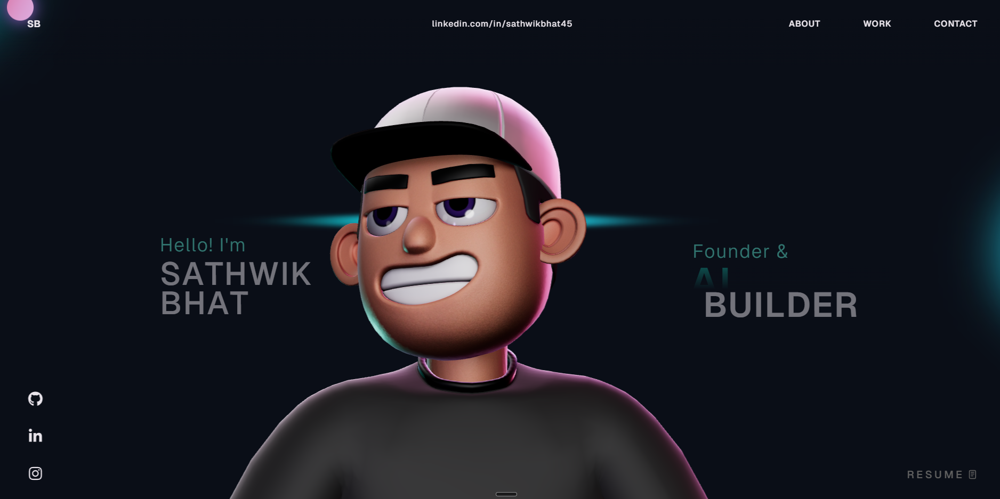
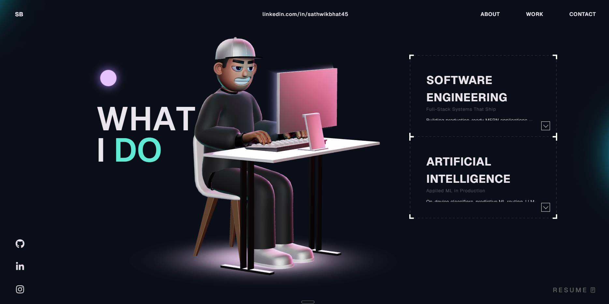

# 🚀 Interactive 3D Developer Portfolio

[](https://reactjs.org/)
[](https://threejs.org/)
[](https://gsap.com/)
[](https://vitejs.dev/)
[](https://www.typescriptlang.org/)

An immersive, hardware-accelerated 3D developer portfolio website built using **React**, **Three.js**, **React Three Fiber (R3F)**, and **GSAP animations**. Includes a fully animated character scene, interactive project carousels, custom physics, and ultra-smooth scroll transitions.

---

## 📸 Preview

<p align="center">
  
</p>

<p align="center">
  
</p>

---

## ✨ Features

* **3D Character Scene**: Hardware-accelerated 3D character rendering powered by React Three Fiber and Three.js.
* **Physics & Interactions**: Dynamic camera angles, custom physics boundaries, and responsive 3D workspace.
* **Premium Animations**: Super-smooth scroll-driven timeline animations powered by GSAP.
* **Interactive Project Showcase**: Responsive slide carousels showcasing cyber security, intelligence, and software engineering projects with real screenshots.
* **Clean & Modular**: Component-driven architecture built for easy customization.

---

## 🛠️ Tech Stack

* **Frontend Framework**: React 18 & TypeScript
* **Build Tool**: Vite
* **3D Engine**: Three.js, React Three Fiber (R3F), `@react-three/drei`
* **Physics Engines**: `@react-three/cannon` & `@react-three/rapier`
* **Animations**: GSAP (GreenSock) & `@gsap/react`
* **Icons & Components**: `react-icons`, `react-fast-marquee`

---

## 🚀 Getting Started

### Prerequisites

* Node.js 18+
* npm 9+

### Quick Setup

1. **Clone the repository**
   ```bash
   git clone https://github.com/sathwikkbhat/interactive-3d-portfolio.git
   cd interactive-3d-portfolio
   ```

2. **Install dependencies**
   ```bash
   npm install
   ```

3. **Run local development server**
   ```bash
   npm run dev
   ```
   *Open [http://localhost:5173/](http://localhost:5173/) in your browser.*

4. **Build for production**
   ```bash
   npm run build
   ```

---

## 🎨 Customization Guide

You can easily adapt this portfolio to show your own profile and projects:

* **Bio & Experience**: Modify `src/components/About.tsx` and `src/components/Career.tsx`.
* **Projects**: Add your own project data and links inside `src/components/Work.tsx`.
* **3D Character Model**: Customize model utilities inside `src/components/Character/`.
* **Styling & Color Palettes**: Edit css files inside `src/components/styles/` or the global rules in `src/index.css`.

---

## 📝 License

This project is open-source and licensed under the [MIT License](LICENSE).
