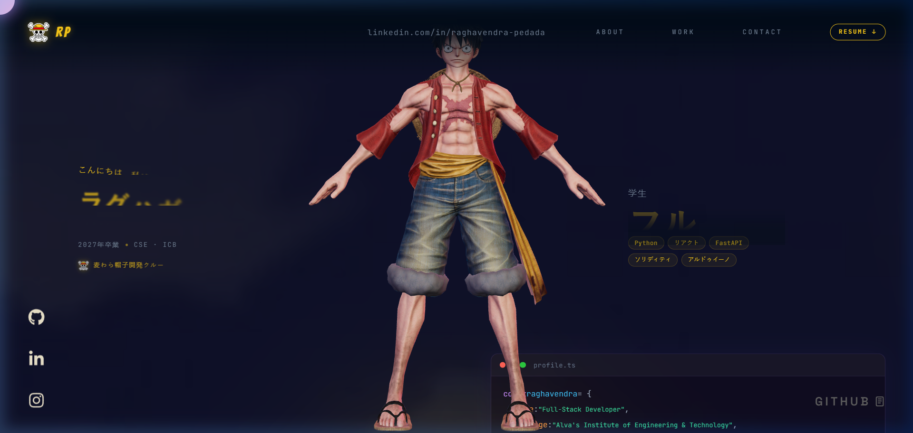
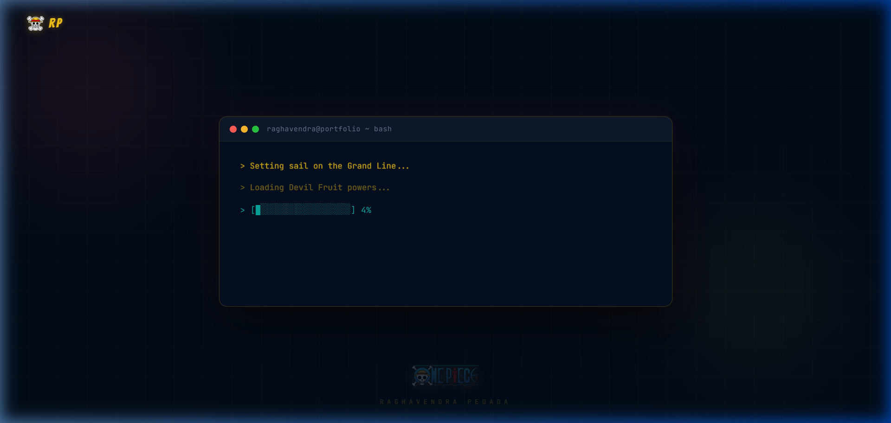

# 🏴‍☠️ One Piece Themed 3D Developer Portfolio

[](https://reactjs.org/)
[](https://threejs.org/)
[](https://gsap.com/)
[](https://vitejs.dev/)
[](https://www.typescriptlang.org/)

An immersive, hardware-accelerated **One Piece themed 3D developer portfolio** for **Raghavendra Pedada** (Full-Stack Developer & CSE Student). Built using **React 18**, **Three.js**, **GSAP animations**.

Features an interactive 3D **Monkey D. Luffy** character with pointer-driven body movement, custom Japanese-to-English TV static glitch effects, anime ocean theme aesthetics, and smooth timeline scroll animations.

---

## 📸 Preview


<p align="center">
  
</p>

<p align="center">
  
</p>

---

## ✨ Key Features

* 🏴‍☠️ **Interactive 3D Luffy Model**: Real-time 3D rendering of Monkey D. Luffy with mouse-following body rotation and procedural breathing idle animation.
* 🎌 **Japanese → Glitch → English Intro**: Dynamic intro revealing page content in Japanese (*こんにちは、私は...*) followed by a TV static scanline & RGB chromatic aberration glitch transition into English.
* 🌊 **One Piece Theme & Branding**: Ocean midnight palette, Straw Hat pirate gold highlights (`#f5c518`), crimson glows, and custom Jolly Roger skull logo.
* ⚡ **Performance Optimized**: Resized model textures, deferred About scene loading, capped pixel ratio, and rendering paused outside the viewport.
* 📱 **Fully Responsive**: Adaptive camera framing, mobile touch interactions, and fluid typography.

---

## 🛠️ Tech Stack

* **Frontend**: React 18, TypeScript
* **Build Tool**: Vite
* **3D Graphics**: Three.js, Three.js built-in GLTF, Draco, and HDR loaders
* **Animations**: GSAP (GreenSock), ScrollTrigger, ScrollSmoother
* **Styling**: Vanilla CSS with custom design tokens & Google Fonts (*Bangers*, *Space Grotesk*, *JetBrains Mono*)

---

## 🚀 Getting Started

### Prerequisites

* Node.js 20.19+ on the 20.x line, or Node.js 22.12+ (24.x recommended)
* npm 9+

### Quick Setup

1. **Clone the repository**
   ```bash
   git clone https://github.com/RaghavendraPedada-1765/portfolio.git
   cd portfolio
   ```

2. **Install dependencies**
   ```bash
   npm install
   ```

3. **Run development server**
   ```bash
   npm run dev
   ```
   *Open [http://localhost:5173/](http://localhost:5173/) in your browser.*

4. **Build for production**
   ```bash
   npm run build
   ```

---

## 👤 Author

**Raghavendra Pedada**
* Full-Stack Developer & CSE Student (Class of 2027)
* [LinkedIn](https://www.linkedin.com/in/raghavendra-pedada-baa349356/)
* [GitHub](https://github.com/RaghavendraPedada-1765)

---

## 📝 License

This project is licensed under the [MIT License](LICENSE).

## Validation and assets

Run `npm run lint`, `npm run build`, then `npm test`. Use `npm run test:dev`
to run the same browser checks against the development server. Install the test browser once
with `npx playwright install chromium`. Browser checks cover resume downloads,
model deferral, mobile menu focus, reduced motion, unavailable WebGL, and slow loading.

The hero uses direct Three.js rendering. The About model loads when its section
enters the viewport. Model textures are capped at 1024 pixels, pixel ratio at 2,
and offscreen scenes skip rendering. Reduced-motion users receive a static scene
and English introduction. Loading can be skipped without waiting for 3D assets.

To optimize newly supplied GLB assets, install the Python dependencies from
`scripts/requirements.txt` and run `python scripts/optimize-models.py`. This keeps
geometry, skins, Draco compression, and animation data unchanged while resizing
embedded PNG textures. Original full-resolution models remain recoverable from Git history.
Reference screenshots, unused images, and obsolete helpers are retained under
`source-assets/`, outside the deployed public directory. The legacy FBX converter
is reference material and requires its original FBX input and Node canvas dependency.

The build uses Vite 8 and its matching React plugin. Three.js source modules
are bundled as separate core, shader, and loader files; the scenes still load
lazily. The normal chunk-size warning threshold remains enabled.
